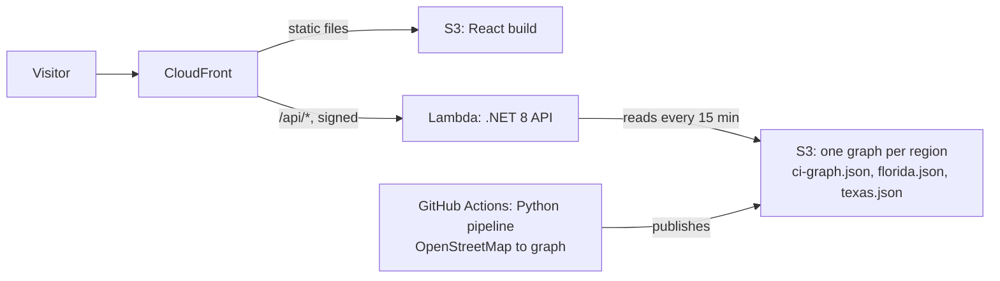

# Geo DevOps Demo

A map app with a .NET API, deployed to AWS by Terraform and GitHub Actions. It has two views:

- **Grid Cascade** (`/#cascade`, the default): draw an area on the map and see which power, water,
  communications and emergency assets fail next, and how far the failure travels.
- **Harbor Watch** (`/#harbor`): incidents, ML.NET hotspots and live weather.

Live at **https://map.spatialenable.com** (serverless: CloudFront, S3, Lambda).



## Documentation

| Page | Covers |
| --- | --- |
| [docs/grid-cascade.md](docs/grid-cascade.md) | Using Grid Cascade, what happens after you draw, the cascade algorithm, the data and its limits, code map |
| [docs/hosting.md](docs/hosting.md) | ECS vs serverless: both architectures, cost, wiring without a VPC, cold starts |
| [SECURITY.md](SECURITY.md) | The six required PR checks, sensitive-content rules, OPA policies, accepted risks |
| [serverless/README.md](serverless/README.md) | Deploying and switching between the two hosting modes |
| [pipeline/README.md](pipeline/README.md) | Building the infrastructure graph from OpenStreetMap |

## Repo layout

```
backend/     .NET 8 minimal API: incidents, hotspots (ML.NET), weather, infrastructure impact
frontend/    React + Vite + ArcGIS Maps SDK: Grid Cascade and Harbor Watch views
pipeline/    Python: OpenStreetMap extract -> infrastructure dependency graph (JSON)
serverless/  Terraform + scripts: S3 + CloudFront + Lambda (live)
infra/       Terraform: ECS Fargate + ALB in a VPC (parked)
policy/      OPA rules applied to Terraform plans, with unit tests
scripts/security/    sensitive-content check run on every PR
.github/workflows/   deploy-serverless.yml, deploy.yml (ECS), terraform-plan.yml, security.yml, ci-graph.yml
```

## Run it locally (no AWS needed)

```bash
# API on :8080 (serves the bundled synthetic sample graph)
dotnet run --project backend

# Frontend on :5173, in another terminal
cd frontend && npm install && npm run dev
```

Open http://localhost:5173. To load a real graph you built with the pipeline instead of the sample:

```bash
CiGraph__Path=build/ci-graph.json dotnet run --project backend
```

Tests: `dotnet test tests/Backend.Tests` (28) and `python -m pytest pipeline/tests` (13).

## Two hosting modes

| Mode | Code | Cost | State |
| --- | --- | --- | --- |
| **Serverless** | `serverless/`, `deploy-serverless.yml` | ~$2-3/month | Live since Oct 7, 2026 |
| **ECS Fargate + ALB** | `infra/`, `deploy.yml` | ~$70-75/month | Parked (`serverless/scripts/park-ecs.sh`) |

Same `backend/` and `frontend/` code in both. The repo variable `DEPLOY_TARGET` (`serverless` or `ecs`)
picks which one deploys on a push to `main`. GitHub Actions reaches AWS through OIDC roles, so no AWS keys
are stored in GitHub. Details in [docs/hosting.md](docs/hosting.md) and [serverless/README.md](serverless/README.md).

## Contributing

Every pull request to `main` must pass six checks: `secrets`, `sensitive`, `iac`, `policy`, `build-test`
and `plan`. See [SECURITY.md](SECURITY.md) for what each one blocks and how to handle a failure.
