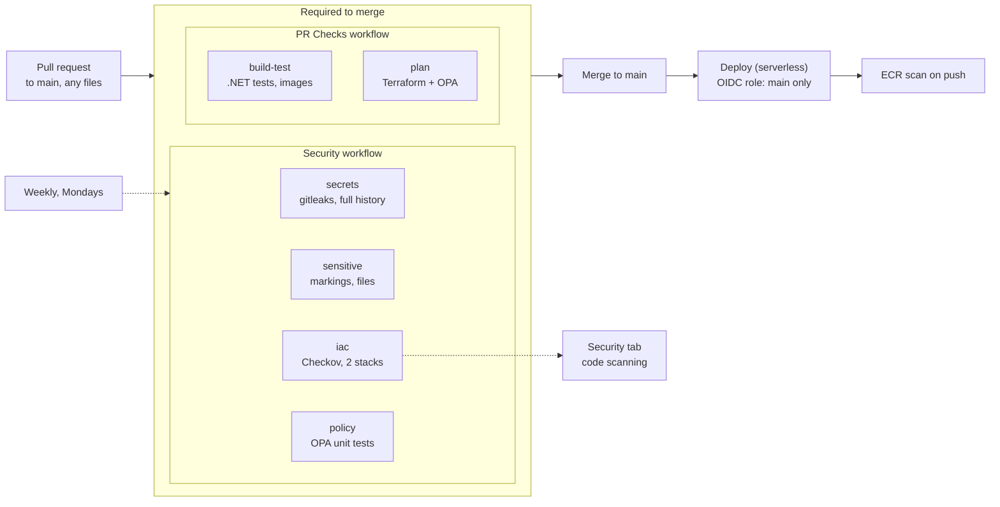

# Security

Every pull request to `main` passes six automated checks before it can merge. Together they keep secrets,
sensitive markings, real infrastructure data and risky cloud settings out of this public repo. The first full
run (Oct 7, 2026) found no secrets and no markings in any commit.

**Reporting a vulnerability:** open a private report from this repo's **Security** tab (*Report a vulnerability*, once private reporting is turned on in Settings -> Code security)
rather than opening a public issue.

## At a glance



## Every check

| Check | Workflow, tool | What it catches | When | Blocks merge |
| --- | --- | --- | --- | --- |
| `secrets` | Security, gitleaks 8.21.2 | API keys, tokens, passwords, private keys, in any commit ever made | Every PR, push to main, weekly | Yes |
| `sensitive` | Security, `scripts/security/check-sensitive.sh` | Handling markings, key/state/env files, PDFs and archives, real infrastructure graphs, files over 5 MB | Every PR, push to main, weekly | Yes |
| `iac` | Security, Checkov 3.3.26 | Insecure Terraform in `infra/` and `serverless/terraform/`; findings also go to the Security tab | Every PR, push to main, weekly | Yes, unless listed in `.checkov.yaml` |
| `policy` | Security, Conftest 0.59.0 | Proves the OPA rules still work (14 unit tests) | Every PR, push to main, weekly | Yes |
| `plan` | PR Checks, Terraform + Conftest | Runs `terraform plan` for the ECS stack and applies the OPA rules to what would change | Every PR | Yes |
| `build-test` | PR Checks, .NET + Docker | 28 backend unit tests; both container images build | Every PR | Yes |
| Pipeline tests | Infrastructure graph, pytest | 13 tests for the OSM graph builder | PRs touching `pipeline/` | No |
| ECR scan on push | Amazon ECR basic scanning | Known CVEs in each pushed image | Every image push | No (ECR console) |

None of the required workflows use path filters: a required check that never starts blocks a PR forever.

## Sensitive content

| Refused | Examples | Why |
| --- | --- | --- |
| Handling markings | PCII, Protected Critical Infrastructure Information, CUI, Controlled Unclassified Information, FOUO, For Official Use Only, TLP:AMBER, TLP:RED, Law Enforcement Sensitive, Sensitive Security Information | Marked material has legal handling rules a public repo can never meet |
| Keys and credentials | `.pem`, `.key`, `.pfx`, `.p12`, `id_rsa*`, `.env`, `kubeconfig*`, `credentials` | Belong in a secrets manager |
| Terraform state and variables | `.tfstate`, `.tfplan`, `terraform.tfvars`, `*.auto.tfvars` | State can hold secrets in plain text |
| Documents and archives | `.pdf`, `.docx`, `.xlsx`, `.pptx`, `.zip`, `.tar.gz` | Their text can't be scanned, so a marking inside would slip through |
| Real infrastructure graphs | `ci-graph*.json` other than the bundled sample; any JSON with `"source": "OpenStreetMap"` and `"sample": false` | The real graph is published to S3 on purpose and never versioned here |
| Large files | Over 5 MB | Usually data or build output committed by mistake |

Acronyms match only in capitals. `.env.example` and `*.tfvars.example` are allowed. Only the check script, the
Security workflow and this file may name the markings. Files committed in the past and since removed produce a
warning, because they remain in git history (today: `infra/Archive.zip`, an old copy of the Terraform files).

## Policy rules (OPA)

`policy/terraform_security.rego` judges the Terraform **plan**, so it sees the real values about to be sent to
AWS. Only resources being created or updated are checked.

| Rule | Result |
| --- | --- |
| GitHub OIDC trust with a `:*` sub (any branch, PR or environment) | Deny |
| Role assumable by Principal `*` | Deny |
| IAM policy with `Action: "*"` | Deny |
| Security group open to `0.0.0.0/0` on a port other than 80/443, or on all protocols | Deny |
| S3 public access block with any setting off | Deny |
| Bucket policy letting `*` put, delete or change objects (public read is allowed) | Deny |
| Canned ACL `public-read-write` or `authenticated-read` | Deny |
| Lambda Function URL with `authorization_type = NONE` | Deny |
| HTTPS listener on an outdated TLS policy | Deny |
| ECR repository without scan on push | Warn |
| Log group without retention | Warn |

Each rule has a deny case and a pass case in `policy/terraform_security_test.rego`. The `plan` job covers the
ECS stack; the serverless deploy role is limited to `main`, so pull requests can't plan it and Checkov covers it.

## Accepted risks

The first Checkov run found 44 issues. Three were fixed (ECR scan on push, security group rule descriptions,
a locked default security group). The rest are skipped in `.checkov.yaml`, each with a reason; anything new fails.

| Reason | Skipped | Cost or need to fix |
| --- | --- | --- |
| Customer-managed KMS keys | ECR, S3, CloudWatch Logs, Lambda env encrypted with a CMK | ~$1/key/month; AWS-managed encryption is on |
| No WAF | CloudFront WAF and Log4j rule, ALB WAF | ~$6+/month |
| No NAT gateway | Public IPs on subnets and ECS tasks; Lambda outside a VPC | ~$33/month; task inbound still limited to the ALB |
| Log volume | 1-year retention, VPC flow logs, ALB/CloudFront/S3 access logs, X-Ray | Storage and ingestion a demo doesn't need |
| Doesn't fit the design | Port 80 redirect, HTTP from ALB to tasks inside the VPC, ALB deletion protection, Lambda DLQ and reserved concurrency, code signing, replication, origin failover, geo restriction, S3 events, AZ pinning, read-only root filesystem | Not applicable or blocked by account limits |
| **To do** | S3 versioning and lifecycle on the site bucket; `Resource "*"` in the ECS deploy role | Grant `s3:PutBucketVersioning`; scope the role to project ARNs |

Delete a line from `.checkov.yaml` once it's fixed, so the check guards it from then on.

## When a check fails

| Check | Real problem | False positive |
| --- | --- | --- |
| `secrets` | Revoke the key **first**, then remove it. It was public the moment it was pushed | Add its fingerprint to `.gitleaksignore` |
| `sensitive` | Remove the file or text. If it was ever pushed it's in history: treat it as disclosed and follow the spill procedure for that marking | Add the path to `ALLOW_RE` in the script |
| `iac` | Fix the Terraform | Add the ID to `.checkov.yaml` with a reason, or `#checkov:skip=CKV_AWS_xxx:reason` on the resource |
| `policy` / `plan` | Fix the Terraform; the message names the resource | Narrow the rule and add a unit test |
| `build-test` | Fix the code or test | |

Run the same checks locally before pushing:

```bash
scripts/security/check-sensitive.sh --history
gitleaks git --redact .                                               # brew install gitleaks
checkov --config-file .checkov.yaml -d infra -d serverless/terraform  # pip install checkov
conftest verify -p policy                                             # brew install conftest
```

## Outside the pipeline

| Control | Where | Purpose |
| --- | --- | --- |
| Required checks | Settings -> Rules -> Rulesets (`main`) | Nothing merges unless all six checks pass |
| Secret scanning and push protection | Settings -> Code security | GitHub rejects a push that contains a secret |
| Code scanning alerts | Security -> Code scanning | Checkov findings tracked over time |
| OIDC instead of access keys | AWS IAM | No long-lived AWS keys in GitHub. Serverless role: `main` only; ECS role: `main` + PR plans |
| Role assumption log | AWS CloudTrail, `AssumeRoleWithWebIdentity` | Shows which branch or event used a deploy role |
| S3 public access audit | `serverless/scripts/s3-public-audit.sh` | Lists buckets readable or writable by the public |
| Budget alert | AWS Budgets | Early warning of abuse or a forgotten resource |
