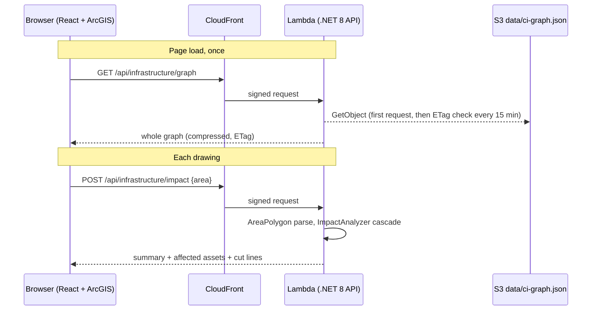

# Grid Cascade

Grid Cascade answers one question: if everything inside an area you draw goes down, which power, water,
communications and emergency assets fail next, and how far does the failure travel? It runs on a dependency
graph built from OpenStreetMap and served by the .NET API.

## Using the tool

Draw an area, and within a second the panel, map and graph show what fails and why. The page opens on a
worked example: a 1.25-mile square around the center of the study area.

1. **Draw an area.** Pick **Polygon**, **Rectangle** or **Freehand** and draw on the map. Everything inside is
   treated as down, and any mapped power line crossing it is treated as cut. **Run the example** redraws the
   starter square; **Clear** removes it.
2. **Read the Impact numbers.** **Failed** = assets that stop working. **On backup** = assets that lost a service
   but keep running on a generator, stored water or radio. **Hops** = the longest chain of dependency links the
   failure travelled. **Reach** = the farthest affected asset from the drawn area, in miles.
3. **Scan the sector table.** Each row is a sector with hit / total. Red is failed, amber is on backup.
4. **Look at the map.** Failed assets are filled with their sector color and ringed in red; on-backup assets
   are white with an amber ring. Cut power lines turn thick red. Arrows colored by service (orange power,
   blue water, purple comms) show which asset took down which, dashed when the receiving asset is on backup.
   Grey grid wires carry arrows in the inferred direction of power flow; dashed grey means unknown.
5. **Use the cascade graph.** Columns are hops (*In the area*, then Hop 1, 2, 3...), rows are sectors. Each
   bubble counts the assets in that sector at that hop; curves show what fed what.
6. **Click any asset.** The popup lists what it depends on (distance in miles and why the link was inferred),
   what it supplies, its coordinates and a link to the OpenStreetMap feature.

**Group nearby assets when zoomed out** clusters points below about 1:60,000. Untick it to see every asset.
The tag under *Draw an area* says which graph is loaded: **SYNTHETIC SAMPLE** is the bundled made-up network
(91 assets); otherwise it names the real region.

## What happens after you draw

One POST carries the polygon to the API, the analyzer runs in memory against the cached graph, and one JSON
response drives the panel, map and graph.

1. **Capture the shape** (`CascadeMap.jsx`). `SketchViewModel` fires `create` with state `complete`; the polygon
   is converted from Web Mercator to longitude/latitude and handed up as GeoJSON.
2. **Send it** (`CascadeApp.jsx` -> `api.js`). Any request still in flight is cancelled, then
   `POST /api/infrastructure/impact` carries `{"area": <GeoJSON>}`. `api.js` adds an `x-amz-content-sha256`
   header, which CloudFront's origin access control needs to sign a POST to the Lambda Function URL.
3. **Route it** (CloudFront). `/api/*` goes to Lambda; everything else is the React build in S3.
4. **Parse the area** (`AreaPolygon.cs`). Polygon, MultiPolygon or Feature, projected to kilometres on a local
   grid for cheap containment, crossing and distance tests.
5. **Get the graph** (`InfrastructureGraphProvider.cs`). In memory; every 15 minutes a conditional GET checks S3
   and swaps in a new version only if the file changed. Fallbacks: `CiGraph__Path`, then the bundled sample.
6. **Run the cascade** (`ImpactAnalyzer.cs`). A pure function of graph and area, described next.
7. **Return and draw.** Summary, one row per affected asset (status, hop, cause, *via*, services lost,
   distance) and cut-line IDs. The panel converts km to miles; the map and graph add their layers.

## The cascade algorithm

The grid is judged by connectivity to a power source, not by "everything downstream fails", so a substation
with a second route stays up.

1. **Direct hits (hop 0).** Every asset inside the area fails.
2. **Cut wires.** Every mapped grid link whose route touches or crosses the area is severed.
3. **Grid islands.** A breadth-first search from every power source over intact wires runs before and after
   the damage. Energy assets energized before but not after have lost every path to a source and fail. Their
   hop is their distance in grid links from the nearest hit asset or cut wire.
4. **Service cascade.** Lowest hop first, each dependent is rechecked. It loses a service (power, water or
   comms) only when **every** supplier of that service has failed. With backup for that service it becomes
   *degraded* and the cascade stops there; without, it fails at supplier hop + 1 and its dependents are next.

| Facility | Rides out loss of |
| --- | --- |
| Hospital, fire station | power, water, comms |
| Police, ambulance station | power, comms |
| Data center, telecom exchange, water treatment plant | power |

Everything else (substations, pumping stations, water towers, cell towers, wastewater plants) has no backup.

## The data

Every asset and wire comes from OpenStreetMap (© OpenStreetMap contributors, ODbL 1.0) via Geofabrik state
extracts. Every dependency is **inferred** from location and tags by `pipeline/build_ci_graph.py`; none comes
from utility records.

| Sector | Kind | OSM tag |
| --- | --- | --- |
| Energy | Power plant, substation | `power=plant`, `power=substation` |
| Energy | Wires | `power=line`, `cable`, `minor_line` |
| Water | Treatment, wastewater, pumping station, water tower | `man_made=water_works`, `wastewater_plant`, `pumping_station`, `water_tower` |
| Communications | Telecom exchange, cell tower | `telecom=exchange`; `man_made=mast`/`tower` with `tower:type=communication` |
| IT | Data center | `telecom=data_center`, `building=data_center` |
| Health, Emergency | Hospital, fire, police, ambulance | `amenity=hospital`, `fire_station`, `police`; `emergency=ambulance_station` |

How the pipeline builds the graph:

1. **Read** the extracts with pyosmium, keeping those tags inside the study circle; assets duplicated across
   neighbouring extracts are counted once.
2. **Project** to the local UTM zone so distances are in metres.
3. **Wire the grid.** A wire ending within 60 m of a substation or plant, or passing within 10 m, connects to
   it. Walking the wires from each substation finds the next one; each pair becomes a link along the real route.
4. **Find power sources.** Plants of at least 20 MW, or untagged but dispatchable (gas, coal, nuclear, oil,
   diesel, hydro, biomass, waste). Rooftop solar doesn't count. Substations with a 115 kV+ wire leaving the area.
5. **Set flow direction.** Higher voltage feeds lower; otherwise the side nearer a source feeds the other;
   otherwise undirected.
6. **Feed unwired substations** from the nearest wired one within 15 km.
7. **Add cross-sector dependencies:** each consumer links to the nearest supplier within range.

| Consumer | Power from | Water from | Comms from |
| --- | --- | --- | --- |
| Water treatment, wastewater plant, sewage pump | substation ≤ 8 km | | |
| Water pumping station | substation ≤ 8 km | treatment plant ≤ 40 km | |
| Water tower | | pumping station or treatment plant ≤ 15 km | |
| Telecom exchange | substation ≤ 8 km | | |
| Cell tower, data center, police, ambulance | substation ≤ 8 km | | exchange ≤ 25 km |
| Hospital, fire station | substation ≤ 8 km | tower, pumping station or plant ≤ 10 km | exchange ≤ 25 km |

The app shows distances in miles (8 km ≈ 5 mi, 25 km ≈ 15.5 mi). Refreshing the data: see
[pipeline/README.md](../pipeline/README.md).

## Limits

Treat results as a plausible what-if built from public map data, not a utility-grade model.

- **Coverage depends on OSM mappers.** An asset that isn't mapped can't fail.
- **Distribution is invisible.** "Nearest substation within 8 km" stands in for the real feeder.
- **Water and comms networks aren't mapped.** Mains, fibre and backhaul are replaced by nearest-supplier rules.
- **No load or capacity.** A surviving path counts as fully powered.
- **Backup lasts forever,** and no time dimension is modelled.
- **One supplier per service,** so real redundancy is missed and impact can be overstated.
- **Area = total loss.** Everything inside the drawing fails completely.

## Code map

| File | What it does |
| --- | --- |
| `pipeline/build_ci_graph.py` | OSM extracts -> `ci-graph.json` |
| `pipeline/fixtures/make_sample_osm.py` | Synthetic Richmond network for tests and the bundled sample |
| `backend/Endpoints/InfrastructureEndpoints.cs` | `GET /api/infrastructure`, `GET .../graph`, `POST .../impact` |
| `backend/Services/InfrastructureGraphProvider.cs` | Loads and refreshes the graph (S3, local path, sample) |
| `backend/Services/InfrastructureGraph.cs` | Parses the JSON and builds lookup indexes |
| `backend/Services/AreaPolygon.cs` | GeoJSON parsing, containment, crossing, distance, area |
| `backend/Services/ImpactAnalyzer.cs` | The four-stage cascade |
| `frontend/src/cascade/CascadeApp.jsx` | Panel: draw tools, KPIs, sector table, impact list |
| `frontend/src/cascade/CascadeMap.jsx` | ArcGIS map layers and sketch tool |
| `frontend/src/cascade/CascadeGraph.jsx` | Hop-by-sector cascade graph |
| `frontend/src/cascade/assetDetails.js` | Popup text |
