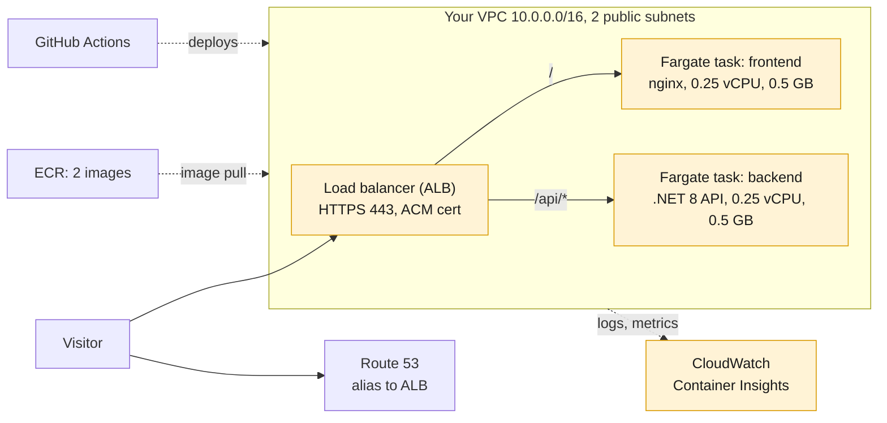
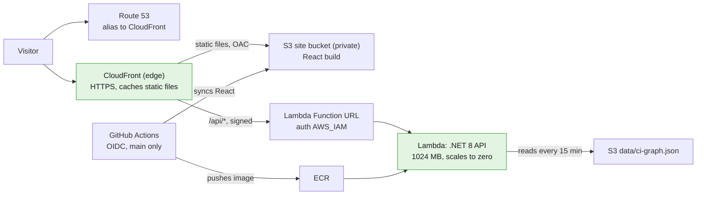

# Hosting: ECS vs serverless

map.spatialenable.com moved on Oct 7, 2026 from an always-on ECS stack (about $75 a month) to CloudFront, S3
and Lambda (about $3 a month). The trade: the first request after the site sits idle waits a few seconds for
Lambda to start.

## The ECS setup (parked)



Amber = billed every hour, visitors or not. Security groups let the ALB accept 443 (and 80, redirected) from
anyone, and the tasks accept 8080 only from the ALB. Parking (`serverless/scripts/park-ecs.sh`) deleted the
load balancer and stopped the tasks; the empty cluster and ECR repositories remain and cost almost nothing.

## The serverless setup (live)



Green = billed per request, inside the free tier at this traffic. CloudFront is the only public entry point.

## Cost

| What it does | ECS, per month | Serverless, per month |
| --- | --- | --- |
| Runs the code | Fargate, 2 small tasks always on: ~$18 | Lambda, only while a request runs: ~$0 (free tier) |
| Front door | Application Load Balancer: ~$16.50 | CloudFront: ~$0 (always-free tier: 1 TB, 10M requests) |
| Public IP addresses | 5 public IPv4 at $0.005/hour: ~$18 | None |
| Monitoring | Container Insights, 63 custom metrics: ~$16 | Lambda logs only: pennies |
| Container images | ECR, 2 repositories: ~$0.40 | ECR, 1 repository: ~$0.40 |
| Files and state | S3: ~$1.40 | S3: ~$1.40 |
| DNS | Route 53 zone: $0.50 | Route 53 zone: $0.50 |
| **Total** | **~$70-75** | **~$2-3** |

ECS figures come from the account's Oct 2-6, 2026 daily costs.

## How it is wired without a VPC

IAM permissions do the job security groups did. Every hop is an AWS-managed endpoint that accepts only the
caller it should.

| Hop | How the caller gets in | What blocks everyone else |
| --- | --- | --- |
| Visitor -> map.spatialenable.com | Route 53 A/AAAA alias to CloudFront; ACM certificate | (public site) |
| CloudFront -> S3 site bucket | Origin access control signs each request; bucket policy names this distribution | Bucket private, public access blocked |
| CloudFront -> Lambda Function URL | OAC signs with SigV4; Lambda permissions name this distribution | Auth type AWS_IAM: unsigned calls get 403 |
| Lambda -> S3 `data/ci-graph.json` | Lambda role: GetObject on `data/*` only | No other bucket or prefix |
| Lambda -> internet (weather.gov) | Lambda's AWS-managed network has outbound internet | Nothing can connect in except through the URL |
| GitHub Actions -> AWS | OIDC token exchanged for the deploy role; no stored keys | Role trusts only `main` of this repo |

A VPC would only be needed to reach private resources such as RDS or ElastiCache, and attaching Lambda to one
would then need a NAT gateway (~$33/month) or VPC endpoints. This app has neither, so it stays out.

## Cold starts

| Situation | ECS | Serverless |
| --- | --- | --- |
| Page (HTML, JS, CSS) | From nginx in us-east-1 | From the nearest CloudFront edge, cached |
| First API call after idle | No cold start | A few seconds: container starts, .NET boots, graph loads from S3 |
| API call while warm | Tens of ms plus network | The same |
| Traffic burst | 1 task; needs autoscaling | New instances start in parallel, each cold once |

Measure cold starts in CloudWatch Logs Insights on `/aws/lambda/geo-devops-demo-sls-api`:

```
filter @type = "REPORT"
| stats count(*) as calls, count(@initDuration) as coldStarts,
        avg(@initDuration) as avgInitMs, max(@initDuration) as maxInitMs,
        avg(@duration) as avgDurationMs by bin(1d)
```

Reduce them, cheapest first:

1. **Keep one instance warm:** an EventBridge schedule calls `/health` every 5 minutes (~8,600 calls a month,
   free tier).
2. **Load the graph at startup** instead of on the first request.
3. **arm64 (Graviton):** about 20% cheaper per millisecond; the Dockerfile already cross-compiles for it.
4. **Provisioned concurrency:** one instance always warm for ~$11/month at 1 GB. Worth it only for a demo day.

Lambda SnapStart works only with zip-packaged functions, not container images like this one.

## How the code is served

| Piece | Language | Where it runs |
| --- | --- | --- |
| Frontend | React | Static files in S3, served by CloudFront, run in the visitor's browser |
| Backend API | .NET 8 (ASP.NET Core) | Container on Lambda. The Lambda Web Adapter turns each Lambda event into a normal HTTP request to Kestrel on port 8080, so `backend/` is the same code ECS ran |
| Data pipeline | Python | GitHub Actions or a laptop; writes `ci-graph.json` to S3, never runs on AWS |

The ECS images (`geo-devops-demo-frontend`, `geo-devops-demo-backend`) aren't used by serverless. Lambda runs
its own image, built from `serverless/lambda/Dockerfile` with the same `backend/` code plus the adapter.
